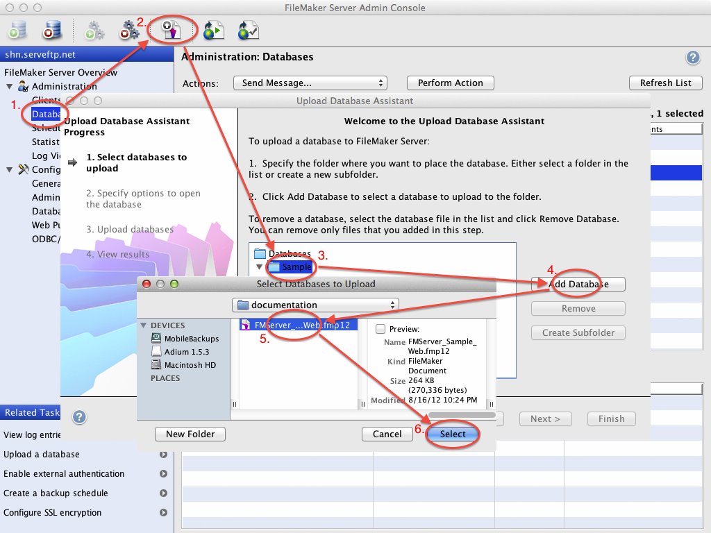

Hosting FMServer_Sample_Web.fmp12
==============================

This example application is pre-configured to assume that FileMaker Server is running on localhost and has the default FileMaker_Sample file is already hosted. If you are running FileMaker Server on another host, be sure to modify the hostname in the config accordingly.

When you have your FileMaker Server host ready, upload FMServer_Sample_Web.fmp12 from this documentation directory.

FileMaker Server 13 or 14
-------------------------

For more detailed information, see [Uploading database files to FileMaker Server](http://help.filemaker.com/app/answers/detail/a_id/11957) in the official FileMaker Knowledge Base.

### Quick Start

1. Open FileMaker Pro or FileMaker Pro Advanced version 13 or 14 
2. Choose File > Sharing > Upload to FileMaker Server
3. Select your host and log in by clicking Next
4. Select FMServer_Sample_Web.fmp12 from this directory
5. Click Upload and verify that it opens without errors

FileMaker Server 12
-------------------

For information on uploading the file to FileMaker Server 12, please see [How do I upload a database in FileMaker Server](http://help.filemaker.com/app/answers/detail/a_id/6526) in the official FileMaker Knowledge Base.
